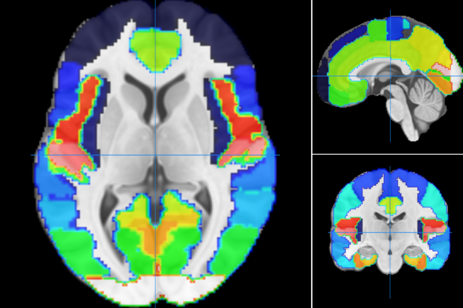

# Atlas-based ROI Selection for fMRI Images #

Requirements:

- MNI152_2009_template.nii.gz
- HarvardOxford-cort-maxprob-thr25-1mm.nii.gz

The HO atlas shares the same coordinate system with the MNI1523 template. It contains an intensity-coded map of selected brain regions. The intensities are defined [here](https://neurovault.org/images/1699/)
For example, a mask for the precentral gryus (intensity 7) can be created with *fslmaths*:

    fslmaths HarvardOxford-cort-maxprob-thr25-1mm.nii.gz -thr 7 -uthr 7 -bin harvard_precentralGyrus.nii.gz

 
In order to obtain a mask in the coordinate system of the functional image, a registration can be performed:

    fnirt --in=MNI152_2009_template.nii.gz --ref=sub-s574_task-rest_acq-0p8mm_bold --iout=MNI_to_functional.nii.gz

 
In a next step the resulting warp matrix is applied to *HarvardOxford-cort-maxprob-thr25-1mm.nii.gz*.

  

 Fig. 1: Atlas *HarvardOxford cort maxprob thr25 2mm*, Source: https://neurovault.org/images/1699/

 
**List of intensity-coded anatomical locations**

    1	frontal pole
    2	insular cortex
    3	superior frontal gyrus
    4	middle frontal gyrus
    5	inferior frontal gyrus, pars triangularis
    6	inferior frontal gyrus, pars opercularis
    7	precentral gyrus
    8	temporal pole
    9	superior temporal gyrus, anterior division
    10	superior temporal gyrus, posterior division
    11	middle temporal gyrus, anterior division
    12	middle temporal gyrus, posterior division
    13	middle temporal gyrus, temporooccipital part
    14	inferior temporal gyrus, anterior division
    15	inferior temporal gyrus, posterior division
    16	inferior temporal gyrus, temporooccipital part
    17	postcentral gyrus
    18	superior parietal lobule
    19	supramarginal gyrus, anterior division
    20	supramarginal gyrus, posterior division
    21	angular gyrus
    22	lateral occipital cortex, superior division
    23	lateral occipital cortex, inferior division
    24	intracalcarine cortex
    25	frontal medial cortex
    26	juxtapositional lobule cortex
    27	subcallosal cortex
    28	paracingulate gyrus
    29	cingulate gyrus, anterior division
    30	cingulate gyrus, posterior division
    31	precuneous cortex
    32	cuneal cortex
    33	frontal orbital cortex
    34	parahippocampal gyrus, anterior division
    35	parahippocampal gyrus, posterior division
    36	lingual gyrus
    37	temporal fusiform cortex, anterior division
    38	temporal fusiform cortex, posterior division
    39	temporal occipital fusiform cortex
    40	occipital fusiform gyrus
    41	frontal operculum cortex
    42	central opercular cortex
    43	parietal operculum cortex
    44	planum polare
    45	heschls gyrus
    46	planum temporale
    47	supracalcarine cortex
    48	occipital pole
