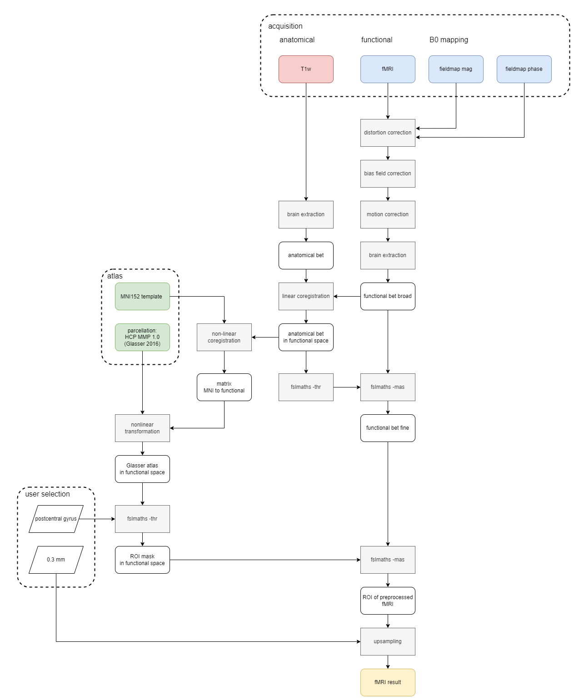

# fMRI Preprocessing and Atlas Registration #

 

    bet data/sub-s574/fmap/sub-s574_acq-0p8mm_magnitude2.nii.gz temp/sub-s574_acq-0p8mm_magnitude2_bet.nii.gz
    
    fslmaths temp/sub-s574_acq-0p8mm_magnitude2_bet.nii.gz -ero temp/sub-s574_acq-0p8mm_magnitude2_bet_ero.nii.gz
    
    fsl_prepare_fieldmap SIEMENS data/sub-s574/fmap/sub-s574_acq-0p8mm_phasediff.nii.gz temp/sub-s574_acq-0p8mm_magnitude2_bet_ero.nii.gz output/sub-s574_acq-0p8mm_magnitude2_biasfieldEstimation.nii.gz 1.02
    
    fugue -i data/sub-s574/func/sub-s574_task-rest_acq-0p8mm_bold.nii.gz --dwell=2.6e-06 --unwarpdir=y --loadfmap=output/sub-s574_acq-0p8mm_magnitude2_biasfieldEstimation.nii.gz -u output/sub-s574_task-rest_acq-0p8mm_bold_undistorted.nii.gz --verbose
    
    fslroi output/sub-s574_task-rest_acq-0p8mm_bold_undistorted.nii.gz temp/sub-s574_task-rest_acq-0p8mm_bold_undistorted_firstimg.nii.gz 0 1
    
    fast -B -o temp/sub-s574_task-rest_acq-0p8mm_bold_undistorted_firstbiascorr.nii.gz temp/sub-s574_task-rest_acq-0p8mm_bold_undistorted_firstimg.nii.gz
    
    rm temp/sub-s574_task-rest_acq-0p8mm_bold_undistorted_firstbiascorr.nii.gz
    
    mv temp/sub-s574_task-rest_acq-0p8mm_bold_undistorted_firstbiascorr_restore.nii.gz temp/sub-s574_task-rest_acq-0p8mm_bold_undistorted_firstbiascorr.nii.gz
    
    fslmaths temp/sub-s574_task-rest_acq-0p8mm_bold_undistorted_firstimg.nii.gz -div temp/sub-s574_task-rest_acq-0p8mm_bold_undistorted_firstbiascorr.nii.gz temp/sub-s574_task-rest_acq-0p8mm_bold_undistorted_biasFieldEstimation.nii.gz
    
    fslmaths temp/sub-s574_task-rest_acq-0p8mm_bold_undistorted_biasFieldEstimation.nii.gz -s 1 temp/sub-s574_task-rest_acq-0p8mm_bold_undistorted_smooth.nii.gz
    
    fslmaths output/sub-s574_task-rest_acq-0p8mm_bold_undistorted.nii.gz -div temp/sub-s574_task-rest_acq-0p8mm_bold_undistorted_smooth.nii.gz biascorr/sub-s574_task-rest_acq-0p8mm_bold_undistorted_biasFieldRemoval.nii.gz
    
    3dvolreg -twopass -prefix output/sub-s574_task-rest_acq-0p8mm_bold_undistorted_biasFieldRemoval_motioncorr.nii.gz biascorr/sub-s574_task-rest_acq-0p8mm_bold_undistorted_biasFieldRemoval.nii.gz
    
    fslroi output/sub-s574_task-rest_acq-0p8mm_bold_undistorted_biasFieldRemoval_motioncorr.nii.gz temp/functional_first.nii.gz 0 1
    
    bet temp/functional_first.nii.gz temp/functional_first_bet.nii.gz -f 0.3 -R
    
    hd-bet -i data/sub-s574/anat/8-t1_mp2rage_sag_HCP_0pp8mm3_T1map_BL5_230717_UNI_DEN.nii -o temp/anatomical_bet.nii.gz -device cpu -mode fast -tta 0
    
    flirt -in temp/anatomical_bet.nii.gz -ref temp/functional_first_bet.nii.gz -noresample -out output/anatomical_bet_functionalspace.nii.gz
    
    bash antsRegistrationSyN.sh -d 3 -f output/anatomical_bet_functionalspace.nii.gz -m atlas/MNI152_2009_template.nii.gz -t 's' -o temp/ANTsOutput
    
    rm output/MNI152_2009_template_functionalspace.nii.gz
    
    rm temp/matrix3.mat
    
    mv temp/ANTsOutputWarped.nii.gz output/MNI152_2009_template_functionalspace.nii.gz
    
    mv temp/ANTsOutput0GenericAffine.mat temp/matrix3.mat
    
    antsApplyTransforms -d 3 -i atlas/HCPMMP1_on_MNI152_ICBM2009a_nlin_hd.nii.gz -r output/anatomical_bet_functionalspace.nii.gz -o output/HCPMMP1_on_MNI152_ICBM2009a_nlin_hd_functionalspace.nii.gz -n NearestNeighbor -t temp/matrix3.mat
    
