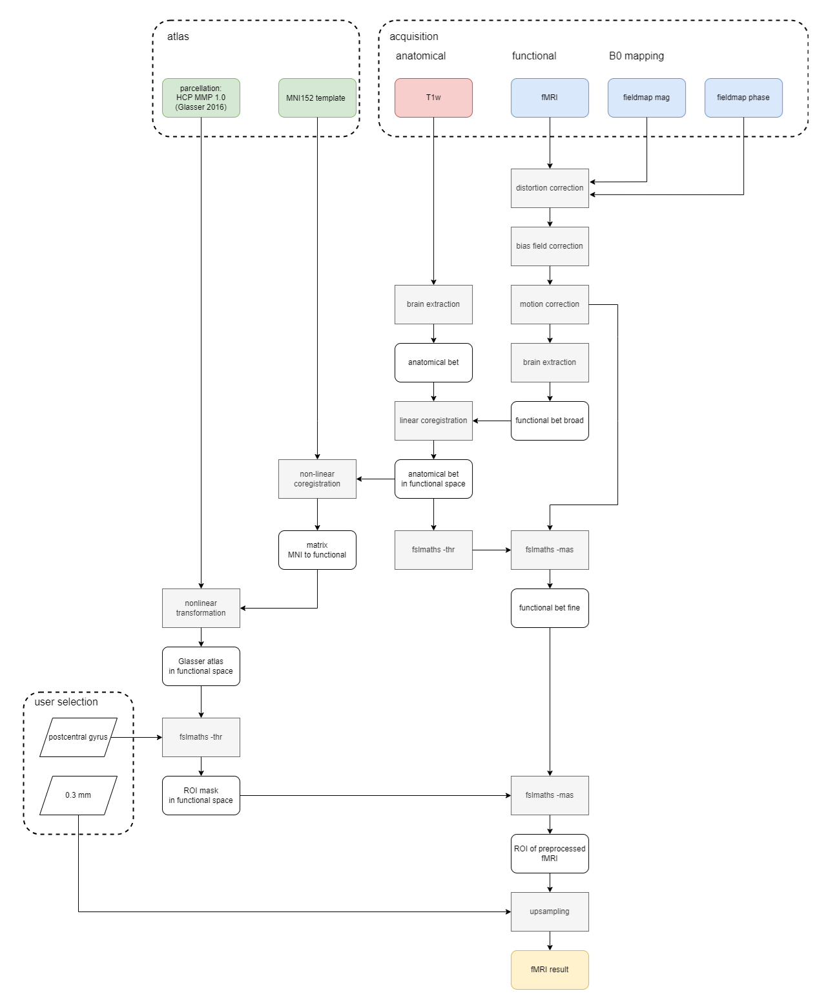

# Layer-fMRI Processing Pipeline #

This is a collection of code for the layer-fMRI processing pipeline. The aim is to create an fMRI processing pipeline that works robustly for ultra-high field 7T functional MRI and preserves cortical layer information by reducing the amount of resampling steps to a minimum.

 
The current preprocessing pipeline comprises the following steps:

## Tasks ##

**Milestones**

- Preprocessing (B0 estimation, distortion correction, bias field correction, motion correction)
- Atlas Coregistration and ROI Selection
- Distortion Correction: performance comparison of blip-up-blip-down vs. magnitude and phase images
- Layer Selection in Freesurfer
- Analysis
	- functional: tapping experiment
	- quantitative difference T1w, T2w
	- tbd
 - Final Report
	

  
**Current Status**: See [progress reports](https://github.com/j-krieg/layerfmri/tree/main/progress_reports) and emails.
  

**Availabilities Julius**:

- October: 40%
- November: 30%
- December: 100%

 
 

## Sequence Overview ##

- CEST (chemical exchange saturation transfer)
	- CEST\_MIMOSA (Multiple interleaved mode saturation, See [Whole-brain quantitative CEST MRI at 7T ](https://pubmed.ncbi.nlm.nih.gov/33634505/)	
	- CEST\_WASABI (simultaneous mapping of the water shift and B1)
	- CEST\_T1_SATREC (control saturation recovery) See [Calibration of arterial spin labeling data](https://onlinelibrary.wiley.com/doi/pdfdirect/10.1002/mrm.28000)
  
- T2s Faruk Gulban, See [A scalable method to improve gray matter segmentation at ultra high field MRI](https://journals.plos.org/plosone/article?id=10.1371/journal.pone.0198335) and [Introduction (p. 24)](http://www.81bones.net/mri/mri_introSlides.pdf)

- T2-star-mapping: used to map inhomogenities

- MP2RAGE (Magnetization Prepared - RApid Gradient Echo)
	[MP-RAGE vs. MP2RAGE](https://mriquestions.com/mp-rage-v-mr2rage.html) :"The MP2RAGE sequence, by comparison, uses two Turbo-FLASH GRE readouts between each inversion pulse."
	

- T2 SPACE: [mrimaster](https://mrimaster.com/characterise-image-3d-tse/#:~:text=This%20makes%20the%20SPACE%20sequence,echo%20sequence%20used%20in%20MRI.): "SPACE (Sampling Perfection with Application optimized Contrasts using different flip-angle Evolutions) is a 3D TSE (turbo spin echo) sequence used in magnetic resonance imaging (MRI). It’s known for providing high-resolution isotropic 3D images, which can be reformatted in any plane without loss of image quality. This makes the SPACE sequence particularly useful for imaging structures with complex anatomy or for cases where multiplanar reconstructions are needed."

- field mapping methods ([source](https://andysbrainbook.readthedocs.io/en/latest/OpenScience/OS/BIDS_Overview.html))
	- GRE field mapping (gradient echo): field mapping with magnitude and phase difference
	- fmap-SE-AP & fmap-SE-PA (spin echoes with opposite phase encoding directions)

<be>

## Available Datasets ##

    +---anat
    |   sub-s574_t1_mp2rage_sag_HCP_0pp8mm3_T1map_BL5_230717_UNI_DEN.nii
    |   
    +---fmap
    |   sub-s574_acq-0p8mm_magnitude2.json
    |   sub-s574_acq-0p8mm_magnitude2.nii.gz
    |   sub-s574_acq-0p8mm_phasediff.json
    |   sub-s574_acq-0p8mm_phasediff.nii.gz
    |   sub-s574_acq-1p3mm_magnitude2.json
    |   sub-s574_acq-1p3mm_magnitude2.nii.gz
    |   sub-s574_acq-1p3mm_phasediff.json
    |   sub-s574_acq-1p3mm_phasediff.nii.gz
    |   
    +---func
    |   sub-s574_task-rest_acq-0p8mm_bold.json
    |   sub-s574_task-rest_acq-0p8mm_bold.nii.gz
    |   sub-s574_task-rest_acq-1p3mm_bold.json
    |   sub-s574_task-rest_acq-1p3mm_bold.nii.gz
